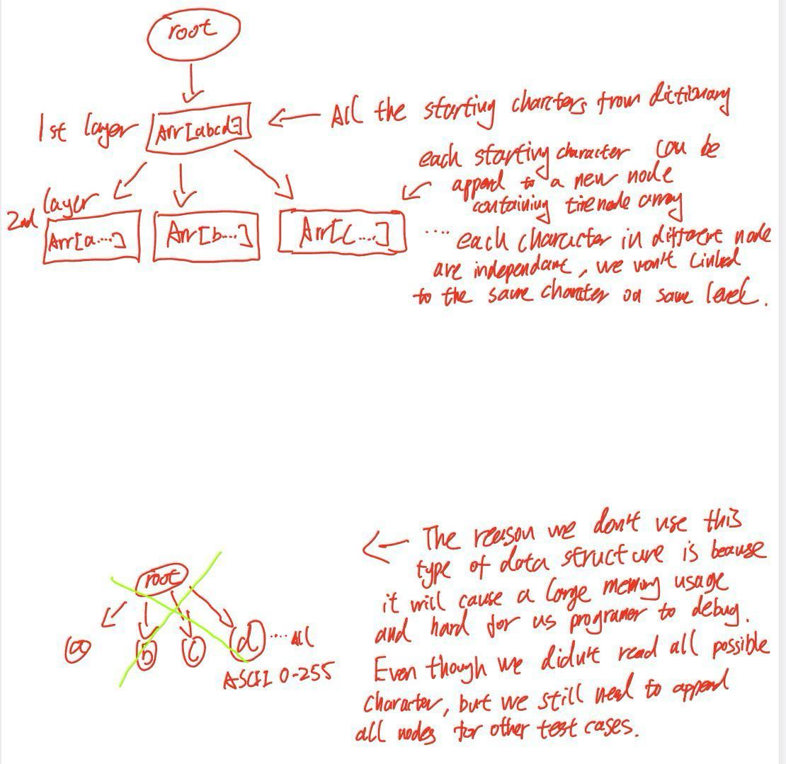
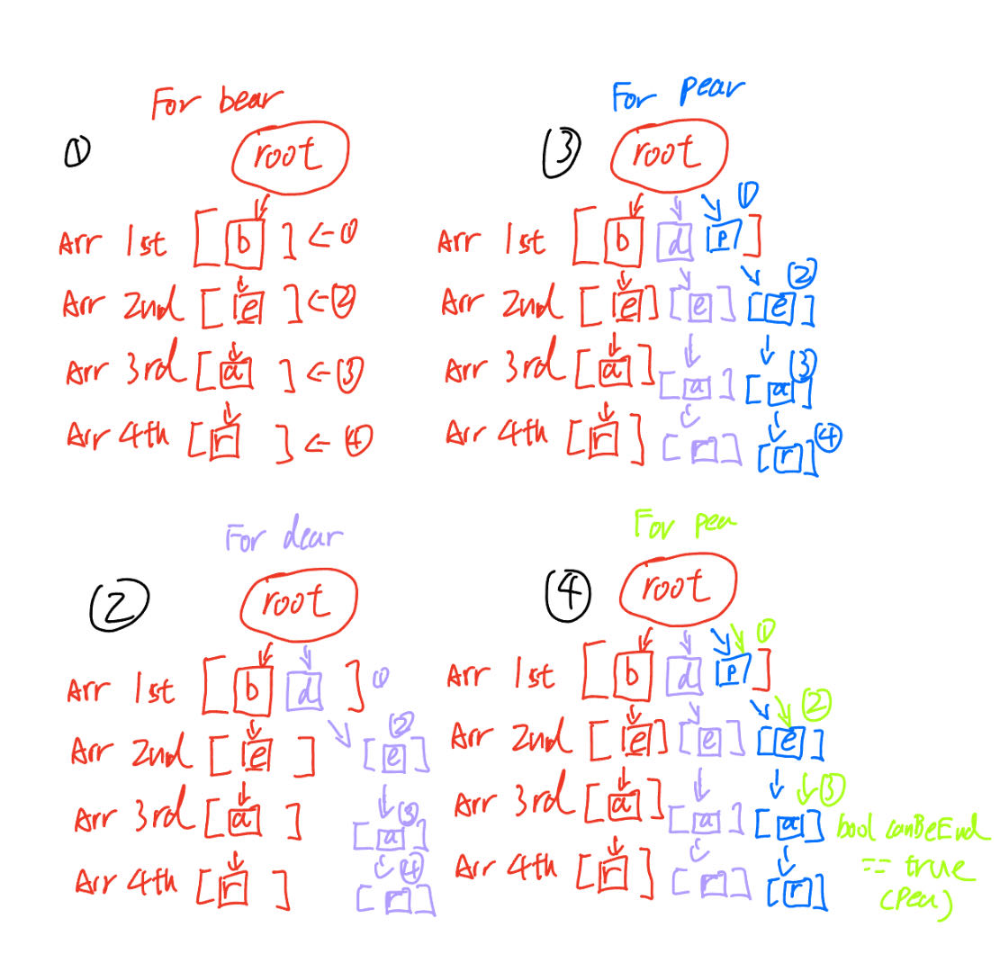
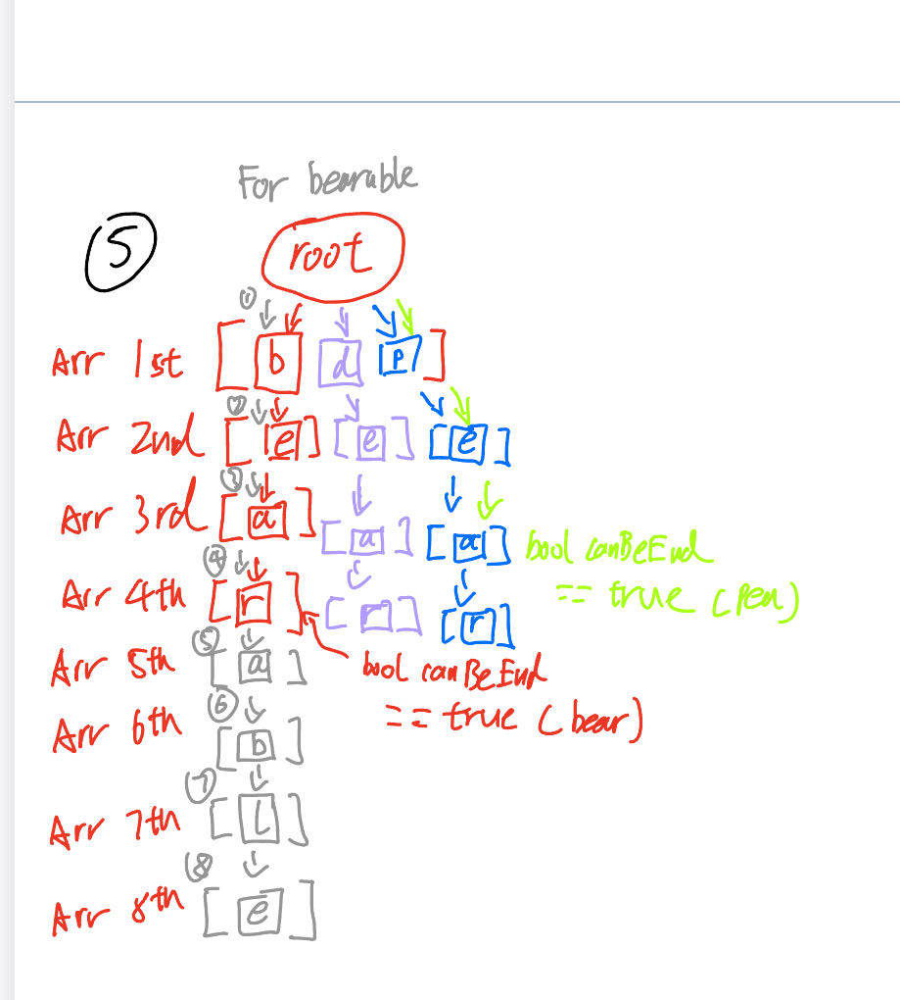

Group member: Mengxi Xia, NetID: MX101. Ziying Zhou, NetID: ZZ561

We use a trie data structure to obtain and check to look up for each word in the text documents. 
Our trie data structure contains a tireNode* nextAlph, a pointer which works like a node in a linked list representing the next node. An unsigned char thisNode, representing a prefix character in the current node. For example, the character ‘a’ in the current node represents every word in the dictionary which has a prefix ‘a’ in its word. A boolean canBeEnd, determine when we traversed our trie, whether or not the current node can be a correctly spelled word ended at the current character(We read a word pear, which pea is also a word). An unsigned char nodeLength to determine the length or an trieNode array. We used char instead of int because we only need to handle ASCII between 0-255, reducing memory usage. Our code reads one byte each time, preventing buffer overflow (read too many bytes at one time with a small-length word). First we read each word(terminated by space or \n) and each line (terminated by \n) from the dictionary (Standard Linux Dictionary), then we called our the insert function that inserts each character into trie structure.  Here is a visual representation of our data structure:

Let’s say that we have a dictionary that contains words: bear, dear, pear, pea and bearable.
Here is an illustration of how these characters are inserted into trie:

Even though we have the same suffix ear or ea, if we have different prefixes, we can’t link to the same index of array. It will cause conflict. 

For checking the “correctness” of a word, we simply traverse the trie. Since each node of a trie is an array of characters, and each character can also be a node that has a child where the child of its current node is the character that follows the current character. We read one character each time, checking whether the current character can be determined as the end of the word (bool canBeEnd). If we finished reading a word from a text file and there are still remaining child nodes in our trie structure and bool canBeEnd of current character is false (meaning that current character can not be the end of a word according to our dictionary), or we can’t find the corresponding order of the word in our trie, we consider a misspelled word and we print the location of the file indicating that there’s a mistake here.

Our program has successfully handled cases like hyphens (-). For hyphenated words like yes-book-no, where yes, book and no exist in our dictionary, our code will check for the words in the hyphenated word: yes, book, and no. If any of these words are misspelled or not in the dictionary, we will just simply print the whole hyphenated word yes-book-no and indicate where’s the mistake.

Some common mistake people might make is that they often ignore all the punctuation that appears in the word. Since in the write up stated that we ignore punctuation at the end of a word, and we only ignore ', ", (, [, and { in the begaining of the word. We do NOT ignore it if it's anywhere else in the word. For example, in the standard English dictionary, b?/o///bb&$^#b won’t be considered as a correct word, but we have to handle the cases that b?/o///bb&$^#b might actually appear in the dictionary. Also when we look at 12/"bob"/4212, we can simply ignore the “/4212 as a trailing punctuation. Even though there is a misspelled word that contains punctuation at the end, we won’t print the punctuation at the end, we just ignore them.

For debugging usage, we have a copy version of the Linux standard dictionary, along with some test cases designed by our own. We can compare the words read by a copy version of the dictionary to the original standard dictionary to test our capability of handling large amounts of data. Our own test cases are designed to handle punctuations, and numbers’ edge cases. All characters in test files must matched the ASCII value in the ASCII table. Other characters won't be ACCEPTED. For exmaple: Chinese characters 中文 won't be accepted. In addition, we won't accpept word length that is greater than 100. The longest word in any of the major English language dictionaries is pneumonoultramicroscopicsilicovolcanoconiosis (45 letters). We account for the situation that people combined certain words together using Hypen (-). 100 Chracters is way enough for people to made up words, otherwise the words longer than 100 characters make no sense.

For runing our program, call make to complie, then type ./spchk original.txt testFolder and you can run and test our code.

